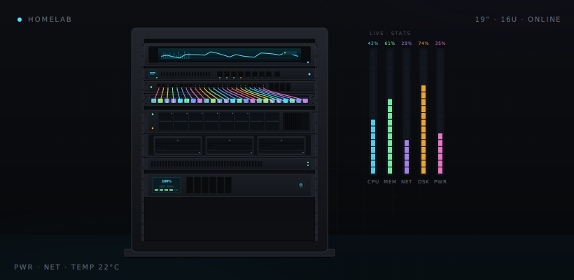

#  homelab

[](https://github.com/afonsoc12/homelab/actions/workflows/ci.yml)
[](https://github.com/afonsoc12/homelab/actions/workflows/docs.yml)

GitOps-driven homelab. Self-hosted. Automated. Encrypted.

<p align="center">
  
</p>

<p align="center">
  <a href="https://afonsoc12.github.io/homelab"></a>
</p>

---
## 📖 About

This repository is the single source of truth for my homelab — a fully GitOps-driven setup where every change is version-controlled and automatically applied:

- **Kubernetes workloads** — managed by [ArgoCD](https://argoproj.github.io/cd/) via GitOps
- **Node provisioning** — handled by [Ansible](https://www.ansible.com/)
- **External infrastructure** — Cloudflare DNS, tunnels, and more via [Terraform](https://www.terraform.io/)
- **Secrets** — encrypted with [SOPS](https://github.com/getsops/sops), never committed in plaintext

---
## 🗂️ Repository Layout

###  Ansible

[Ansible](https://www.ansible.com/) handles node provisioning and cluster lifecycle management — k3s installation and upgrades, OS configuration, [Tailscale](https://tailscale.com/) enrollment, and ongoing maintenance across all nodes. Uses [uv](https://docs.astral.sh/uv/) for dependency management.

```bash
uv sync --all-groups
uv run ansible-playbook ansible/playbooks/k3s-cluster.yml
```

###  Terraform

[Terraform](https://www.terraform.io/) manages external infrastructure-as-code (IaC). The [`cloudflare`](terraform/cloudflare/) module covers DNS records, Cloudflare Tunnel, WAF rules, and zone settings across two domains.

```bash
cd terraform/cloudflare
terraform init -backend-config=../.decrypted~backend.sops.tfbackend
terraform plan && terraform apply
```

###  k8s Apps

All apps are declared as [ArgoCD](https://argoproj.github.io/cd/) `Application` manifests under [`kubernetes/apps/addons/argocd-apps/templates/`](kubernetes/apps/addons/argocd-apps/templates/). Pushing to `master` is enough — ArgoCD detects drift and syncs automatically. To add a new app, drop a values file and an Application manifest, then push.

###  Helm Charts

Ad-hoc Kubernetes resources that don't belong to a specific app (CRDs, cluster-wide config) live as [Helm](https://helm.sh/) charts under [`kubernetes/charts/`](kubernetes/charts/).


### 🔐 Secrets (SOPS)

All secrets are [SOPS](https://github.com/getsops/sops)-encrypted (`.sops.yaml`) and **never committed in plaintext**. Ansible, Terraform, and ArgoCD each decrypt on the fly at runtime — no manual steps required.

| Tool | Secrets location |
|------|-----------------|
| Ansible | [`ansible/inventory/hosts_secrets.sops.yaml`](ansible/inventory/hosts_secrets.sops.yaml) |
| Terraform | [`secrets.sops.yaml`](terraform/cloudflare/secrets.sops.yaml) per module |
| Kubernetes | [`values.sops.yaml`](kubernetes/apps/values.sops.yaml) alongside plain `values.yaml` |

---
## License

**Copyright © 2026 [Afonso Costa](https://github.com/afonsoc12)**

Licensed under the MIT License. See the [LICENSE](./LICENSE) file for details.
