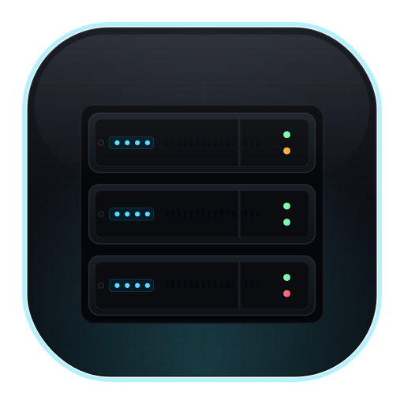

#  homelab

GitOps-driven homelab. Self-hosted. Automated. Encrypted.

!!! warning "Work in progress"
    This documentation is still being written and may be incomplete or out of date.

  

    <iframe src="assets/homelab-rack.html" width="820" height="400" scrolling="no" frameborder="0" style="border:none;display:block;"></iframe>
  

---

## About

Single source of truth for my homelab — every piece of infrastructure declared as code, version-controlled, and automatically applied.

-   :material-kubernetes: **Kubernetes workloads**

    Managed by [ArgoCD](https://argoproj.github.io/cd/) via [GitOps](kubernetes/argocd.md). Push to `master`, the cluster syncs itself.

-   :simple-ansible: **Server provisioning**

    [k3s](https://k3s.io) cluster setup and server management handled by [Ansible](https://www.ansible.com/).

-   :simple-terraform: **Infrastructure**

    [Cloudflare](https://www.cloudflare.com) DNS, tunnels, and more via [Terraform](https://www.terraform.io/).

-   :material-key-chain: **Secrets**

    Encrypted at rest with [SOPS](https://github.com/getsops/sops). Never committed in plaintext.

---

## Explore

-   :material-math-compass: **Architecture**

    ---

    High-level design, cluster servers, and networking.

    [:octicons-arrow-right-24: Overview](architecture/overview.md)

-   :material-apps: **Services**

    ---

    All running services across every namespace.

    [:octicons-arrow-right-24: Services](services/index.md)

-   :material-kubernetes: **Kubernetes**

    ---

    [ArgoCD](https://argoproj.github.io/cd/) GitOps, namespaces, and how to add a new app.

    [:octicons-arrow-right-24: GitOps with ArgoCD](kubernetes/argocd.md)

-   :simple-ansible: **Ansible**

    ---

    Server provisioning, [k3s](https://k3s.io) cluster management, and playbooks.

    [:octicons-arrow-right-24: Ansible docs](ansible/overview.md)

-   :simple-terraform: **Terraform**

    ---

    [Cloudflare](https://www.cloudflare.com) DNS, tunnels, and external infrastructure.

    [:octicons-arrow-right-24: Terraform docs](terraform/overview.md)

-   :material-key-chain: **Secrets**

    ---

    [SOPS](https://github.com/getsops/sops) encryption rules and secret management patterns.

    [:octicons-arrow-right-24: Secrets](secrets.md)

-   :material-book-open-variant: **Runbooks**

    ---

    Step-by-step operational procedures.

    [:octicons-arrow-right-24: Runbooks](runbooks/k3s-upgrade.md)

